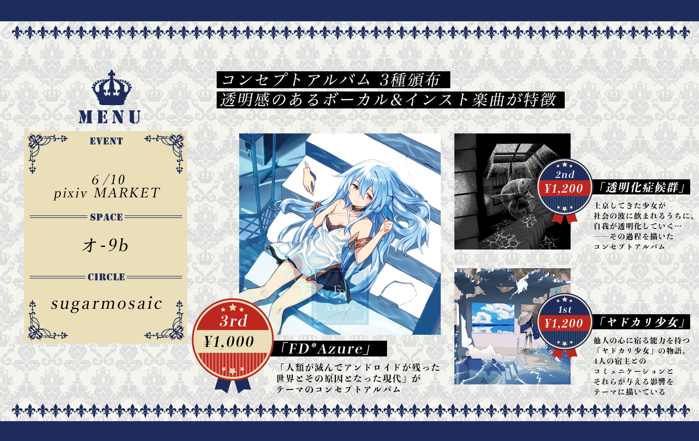
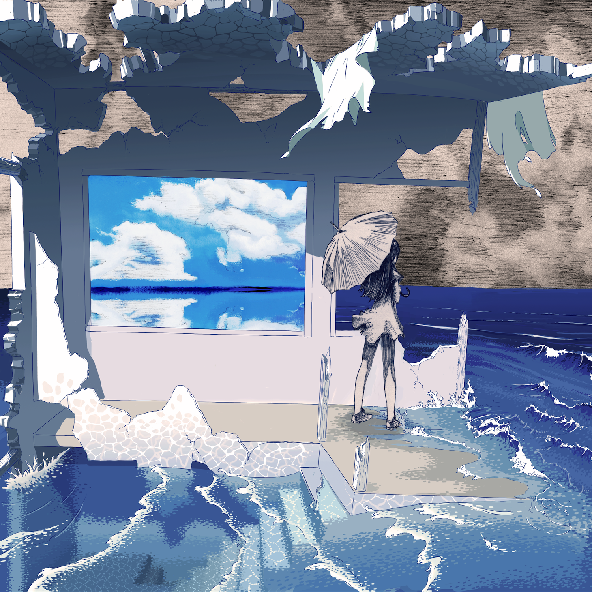
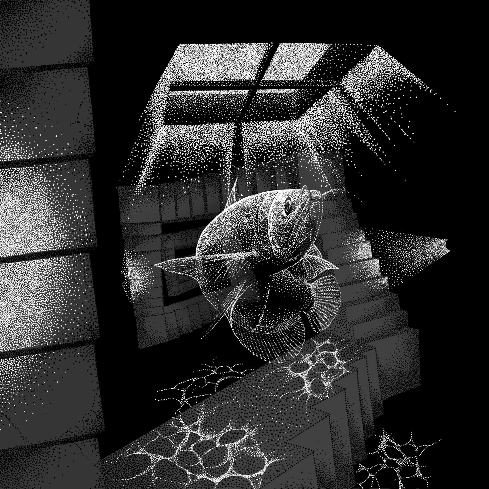

# About sugarmosaic
コンセプトアルバム制作を行っている音楽サークル。
透明感のあるボーカル & インスト曲とマルチジャンルな展開が特徴。

* Official Site: http://sugarmosaic
* Twitter: https://twitter.com/nyakuro

# About pixiv MARKET
6/10(日)池袋サンシャインシティで開かれる、
世界初、キャッシュレスな同人誌即売会！
https://market.pixiv.net/

sugarmosaicは、スペース番号「オ-9b」で参加しています！

# お品書き
コンセプトアルバム3種類を持っていきます。
試聴はリンクから

* 【1st】 ヤドカリ少女  
　http://sugarmosaic.com/discography/
* 【2nd】 透明化症候群  
　http://sugarmosaic.com/discography/
* 【3rd】 FD*Azure  
　https://www.youtube.com/watch?v=0ZsLts-TNds

# 作品紹介
## ヤドカリ少女 (1st Album)

### コンセプト

他人の心に宿る能力を持った「ヤドカリ少女」の物語です。
「少女は4人の宿主と出会い、互いの心に触れ合う。」という名目で、
他者とのコミュニケーションとそれが与える影響をテーマに描いてます。

どうでも良いことですが、社会人1〜2年目に曲を書いてたので、心なしか未来への希望とか暖かさを感じますね。

### どんな音楽？
温かみがあって、透明感がある音楽が多いです。
サントラっぽさも一番強いかもしれません。
ウィスパー系ボイス & オーケストラ、ポップ、エレクトロニカなどを組み合わせてプログレっぽい展開したりします。

### ジャケット仕様
切り込みが入った特殊デジパック。
歌詞カードを入れ替えるとジャケットの一部が変わります。

- - -

## 透明化症候群(2nd Album)

### コンセプト
上京してきた少女が社会の波に飲まれて自我が透明化していく…という感じのアルバムです。

自分にしか出来ないことをしたい！意味のある人生にしたい！
と思いながら東京に来て働いていたのに、頑張っても空回りして結局うまくいかない。
少女は、自然と他人に合わせて生きていくようになり…。

…

社会人3年目の自分、一体何があったんだ…

### どんな音楽？
ウィスパーボイスな所は変わりませんが、とにかくアングラでエレクトロでロックでアンビエントな重い感じを目指しました。

当時、ファッション鬱っぽいJPOPが流行っていたんですが、鬱っぽい曲ってもっと違くない？という反骨精神もあったような気がします。

中盤〜後半に行くほど、心象風景的な描写が増えてくるので浸れるかもしれません。

### ジャケット仕様
透明カード3枚が差し込まれた特殊デジパックです。
盤面の黒が透けて見えます！
透明カードを別の印刷所に作っていただき、デジパックの印刷所さんに投げ込みをしてもらいました。

- - -

## FD*Azure(3rd Album)

### コンセプト

「人類が滅んでアンドロイドが残った世界とその原因となった現代」がテーマのコンセプトアルバムです。
部位欠損したアンドロイド少女が表紙を飾ってます。

過去の積み重ねと今の選択はどんな未来に繋がるのか？
というのが大枠の問いかけとなっていて、現在・現代で起こっている事がこのまま未来へ繋がっていったら人類は滅んでしまうこともあり得るのだろうか？そして、今取るべき選択は何なんだろうか？
と考えたのがきっかけとなっています。

1曲目がSustainable Deterioration（持続可能な衰退）というタイトルなのも、2nd Albumで透明になった少女が、見えているはずの未来に蓋をして選択しなかった結果…なのかもしれません。

果たして、ジャケットのアンドロイド少女はどんな選択をするのでしょうか？

...  

社会人5年目になっても何か許せない事があったのでしょうか

### どんな音楽？

とにかくエモいアルバムが作りたい！
というエモさ至上主義なアルバムです。エモエモのエモちゃん。

ウィスパーボイスは変わらず、
ジャンルはエレクトロ + オーケストラ中心のアルバムになっています。
ワブルベースを導入したり、ウワモノシンセの扱いを今までと変えたり色々しました。

本編の曲数は今までよりも少なくなりましたが、
制作の手間的にはそれほど変わらず、
今までよりもガチ曲がグッと詰め込まれた構成になっていると思います。

### ジャケット仕様
1st、2ndとは作り方を変えていて、
平賀まつりさんがジャケットイラスト、
monoraldeeがロゴやインナーや歌詞カードのデザインを担当しています。

仕様自体も大きく変えていて、デジパックから紙ジャケットに変わっています。
よくある紙ジャケットとは違って、厚みのある若干お高いな紙ジャケットですｗ
